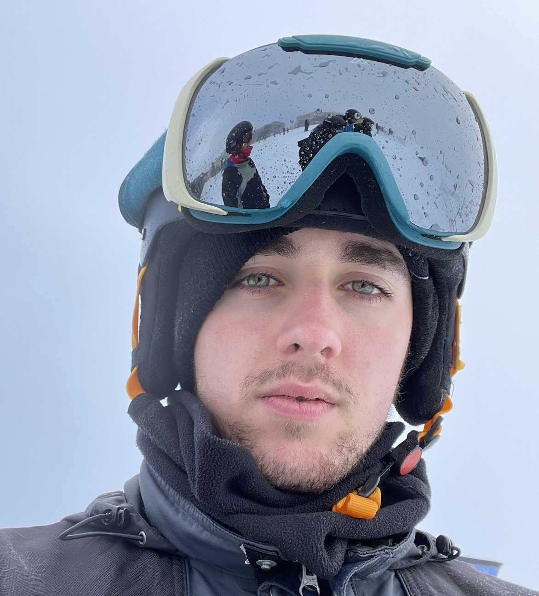
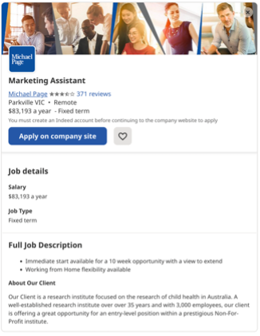
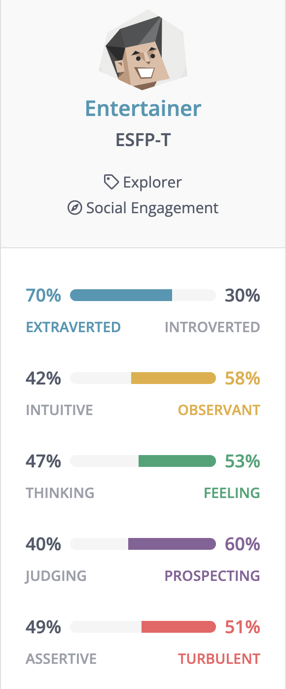
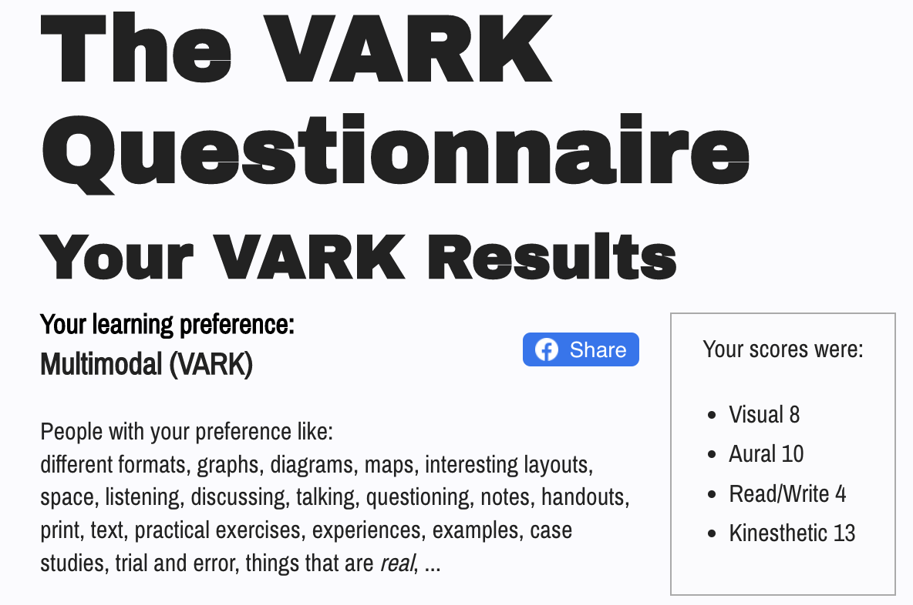
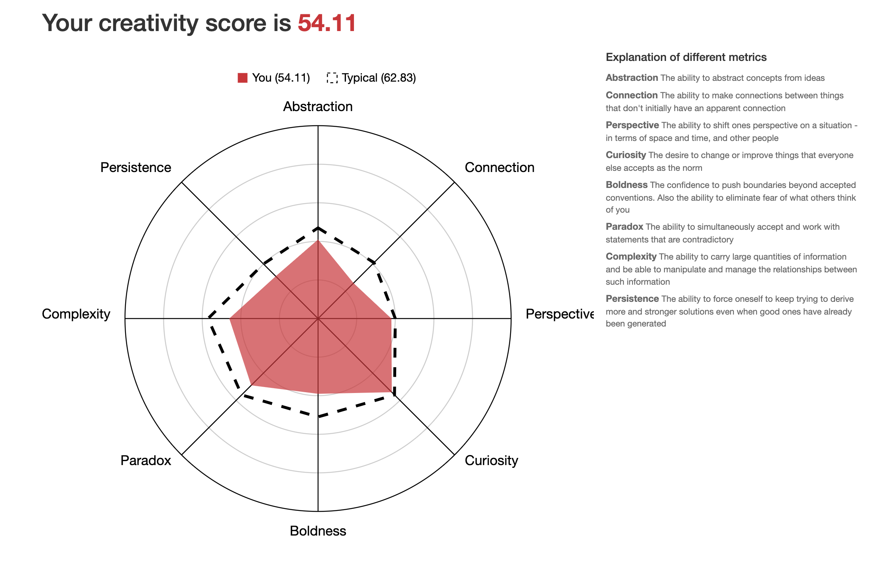

# My Profile

### Personal Information

My name is Theo Constas, I am 19 years old, and I am from Melbourne, Australia, a place that I was born and have lived my entire life in.

I graduated at Overnewton Anglican Community College and began studying at RMIT in 2021 in a Bachelor of Business course majoring in Marketing.

I am a 3rd generation immigrant as all my grandparents immigrated from Greece to start a new life in Australia. In my family, I have one younger brother and one older sister, making me the middle child and of course having middle child syndrome. As well in the family we have on dog who is 12 years old, and is a cross breed, being half Shih Tzu, and half Jack Russel.

I used to find difficulty finding hobbies to stick to but over time I found that I enjoyed Tennis, which however I dropped right before entering senior level competition and instead begun training in the gym for a source of fitness.

Gaming is another hobby that I enjoy, as I have great memories in games such as GTA 5, Minecraft, GMOD and much more recently Rocket League and Fortnite. My gaming hobby mixes well with my drive to socialise, as I usually only find myself gaming a lot when I am playing with friends, and if not gaming, I enjoy spending time with my friends going out drinking or doing activities.

My goals for the future are to become wealthy to the point where I could pass down wealth to give future generations a somewhat more comfortable lifestyle. Goals for myself are to also explore the world, visiting countries for their unique cultures, languages and nature.

### Interest in IT
My interest in business has always led me to the concept of innovation, making society a little better than it currently is. My personal beliefs is that in the modern day, this is achieved through the development of technology, whether or not it is essential or not. My belief is that knowledge in IT is necessary for people who want to go forward into the future with an understanding in how the world works, which is why I attempt to fill my elective classes with subjects that can teach me basics of coding languages or develop my understanding in Information technology.

I believe that in my studies in business and IT, I can go down my own path towards entrepreneurship, and explore my own way to innovate and bring a new service/product to society that can make it that one little bit better, in which I can learn the skills to do so with these classes.

### Ideal Job

My ideal first job is one in marketing, something that will allow me to gain experience in how the operations of marketing are properly run in a business for a certain amount of time. This can allow me to also see other aspects of how a business is run, allowing me to decide what the next stage in my life would be, whether it would be to slowly pick up my own ventures or to start my own business and pursue my desire of innovation.

https://au.indeed.com/Michael-Page-jobs?vjk=4d15dc448e34821f

### Personal Profile
#### Myers-Briggs

The 16 personalities test results labelled me as an entertainer, stating that I love being around friends and soaking up attention and having a fun time, whilst also ensuring that those around me are having just as great of a time.

This test labelled me as 70% extroverted, as well as 58% observant, showing my ability to speak when I need to and hold good conversations whilst also having the ability to get things done when they need to. This can greatly benefit a teamwork situation.

#### Learning Style

The Vark Questionnaire was used as a test for the learning style was used to determine my learning style. It asked which forms information sharing were easiest to learn from, and the test results in the end stated that my learning preferences were multimodal.

Multimodal means that I prefer to learn from multiple sources of information at once, including visual, audible and of example from others.

This can be appropriate in a team setting as conversing and sharing information can be made easier by myself to others, as well as better used in presentations.

The results also show my desire for trial and error, sharing that I prefer to make mistakes in order to better improve my work.

#### Creativity

The creativity test which I took was from AULIVE titled “test my creativity”, which gave me a score of 54.11, lower than the average score of 62.83. Although below average, the test ranked my curiosity, paradox and complexity at a higher level than connection, persistence and boldness.

This means that I may want to change things that are considered the norm and can find relationships between information that I am given. This can help with problem solving that may occur in the situation of being in a team.

### Project Idea
